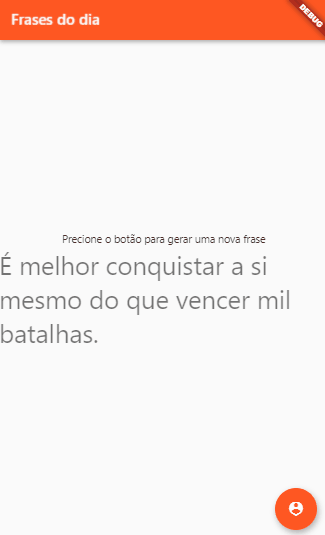

## 🧐 Functions:
- Clicking the button generates a message;
- You will have four messages in total;

Project developed in progress.

 
     

### Getting Started

This project is a starting point for a Flutter application.

A few resources to get you started if this is your first Flutter project:

- [Lab: Write your first Flutter app](https://flutter.dev/docs/get-started/codelab)
- [Cookbook: Useful Flutter samples](https://flutter.dev/docs/cookbook)

For help getting started with Flutter, view our
[online documentation](https://flutter.dev/docs), which offers tutorials,
samples, guidance on mobile development, and a full API reference.

## 📝 Licenças

This project is under the MIT license. See the archive [LICENSE](LICENSE.md) for more details.

<h1 align="center">

  
</h1>